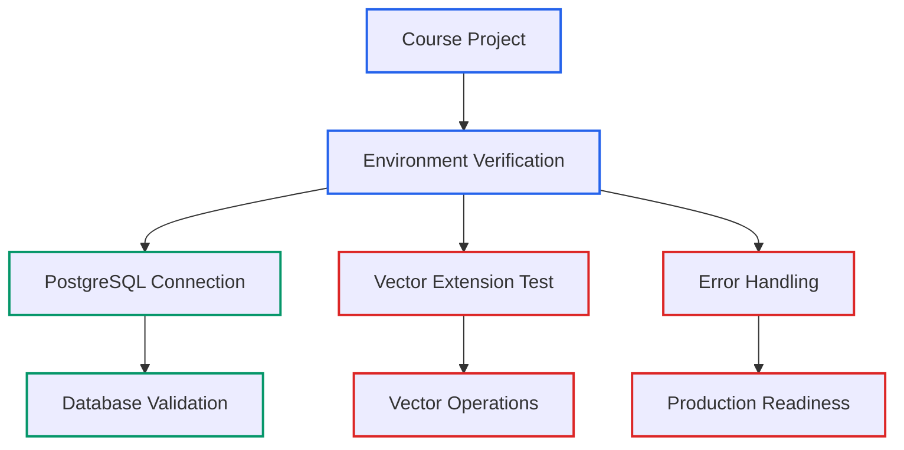

# Lecture 1: Course Introduction - Environment Setup for PostgreSQL Vector Databases

## Learning Objectives

By the end of this lecture, you will:
- Understand the course scope and structure based on the actual project implementation
- Meet your instructor and learn about their expertise in vector databases and PostgreSQL
- Identify what you'll build using the existing verification utility
- Set clear expectations for this focused, hands-on learning experience

## Welcome to the Course

Welcome to "Environment Setup for PostgreSQL Vector Databases" - a focused, practical course that teaches you to build and verify development environments for vector database applications.

## Your Instructor: Joel Smalley, MBA

Your instructor brings over 25 years of experience in digital transformation and database technologies. Joel holds an MBA from University of Toronto's Rotman School of Management and specializes in:

- **AI & Machine Learning**: RAG (Retrieval-Augmented Generation) Systems, Vector Embeddings & Similarity Search, PostgreSQL + pgvector integration
- **System Architecture**: Digital Product Architecture, Production AI System Architecture, API Design
- **Programming Expertise**: TypeScript/Node.js backend development, database optimization, professional development workflows

Joel currently serves as a Web3 Software Architect and has previously held CTO roles, bringing real-world production experience to this course. His expertise with PostgreSQL and vector databases comes from building actual production systems, not just theoretical knowledge.

## What You'll Actually Build

This course is based on a real project implementation found in the codebase. You'll work with:

- **Core Implementation**: A comprehensive environment verification utility (`src/utils/verify-setup.ts`)
- **Database Integration**: PostgreSQL connection testing and pgvector extension verification
- **Vector Operations**: Practical distance calculations and similarity search testing
- **Production Practices**: Error handling, environment validation, and troubleshooting

## Course Philosophy: Real Code Walkthrough

This course follows a unique learning approach:

- **No Code Snippets**: We examine actual project files instead of isolated examples
- **File-Based Learning**: You'll open `src/utils/verify-setup.ts` and follow along as we explain each section
- **Practical Understanding**: Every concept is demonstrated through working, tested code
- **Professional Standards**: Learn TypeScript best practices, error handling, and production considerations

## Learning Journey Overview

**Section 1: Development Environment Setup** (Current Section)
- Claude Code setup for AI-assisted learning
- Project structure and TypeScript configuration
- Node.js and TypeScript development environment
- PostgreSQL and pgvector installation

**Section 2: Verification Utility Implementation Analysis**
- Deep dive into the verify-setup.ts utility (src/utils/verify-setup.ts:1-151)
- PostgreSQL connection patterns and error handling
- pgvector extension testing and vector operations
- Comprehensive troubleshooting and debugging

## Prerequisites and Requirements

**Required Knowledge:**
- Basic JavaScript/TypeScript understanding
- Command line familiarity
- Basic database concepts

**Development Environment:**
- Node.js 18+ (verified by our utility at src/utils/verify-setup.ts:14-21)
- PostgreSQL database with pgvector extension
- Code editor (VS Code recommended)

**What You Don't Need:**
- Prior vector database experience
- Advanced AI/ML knowledge
- Production deployment experience

## Course Expectations

**What This Course Covers:**
- Environment setup verification using the actual utility at src/utils/verify-setup.ts
- PostgreSQL and pgvector integration as demonstrated in the verification code
- Error handling and troubleshooting patterns from the verification utility
- TypeScript development practices shown in the existing implementation

**What This Course Doesn't Cover:**
- Full application development (no main application exists in the project)
- Production deployment (not implemented in the project)
- Advanced vector search systems (beyond basic verification)
- Machine learning or AI implementation

## Claude Code Integration

Throughout this course, you'll learn specific prompts to use with Claude Code for:

- **Environment Debugging**: "Help me troubleshoot this PostgreSQL connection error in my verify-setup utility"
- **Code Analysis**: "Explain the vector distance calculation in src/utils/verify-setup.ts lines 83-86"
- **Error Resolution**: "Fix this pgvector extension error in my Node.js application"

## Key Takeaways

- This course focuses on practical environment setup using real, working code
- You'll master PostgreSQL and pgvector integration through hands-on verification
- Every lesson references actual files in the project, not theoretical examples
- Your instructor brings production experience with these exact technologies

## Next Steps

In the next lecture, we'll examine the project structure and understand how the TypeScript configuration supports our database verification utility.

Open your code editor and navigate to the project root - we're about to dive into the actual implementation that makes this course possible.