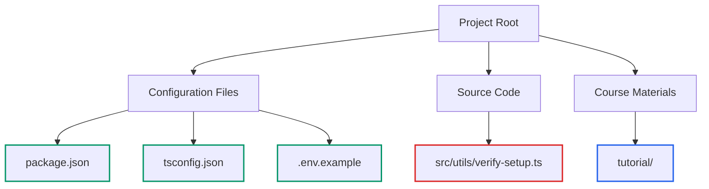
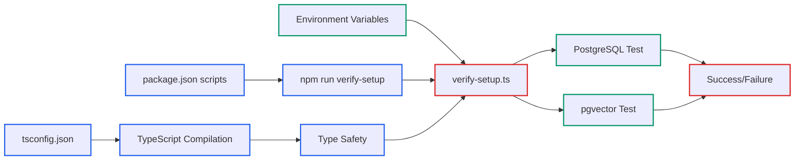

# Lecture 3: Project Structure and TypeScript Configuration Walkthrough

## Learning Objectives

By the end of this lecture, you will:

- Navigate the actual project structure and understand each file's purpose
- Examine the TypeScript configuration that enables our database utilities
- Understand the package.json scripts and their role in development workflow
- Identify how environment configuration supports PostgreSQL integration

## Project Structure Overview

Let's examine the actual files in our project.

```
nodejs-postgres-pgvector/
├── .env.example                    # Environment configuration template
├── package.json                    # Project dependencies and scripts
├── tsconfig.json                   # TypeScript compiler configuration
├── src/
│   └── utils/
│       └── verify-setup.ts         # Our core verification utility
└── tutorial/                       # Course materials (what we're building)
```



## TypeScript Configuration Deep Dive

Open `tsconfig.json` in your editor. This file configures how TypeScript compiles our code:

**Key Configuration Points:**

- **Target**: `ES2022` (tsconfig.json:3) - Modern JavaScript features for Node.js 18+
- **Module System**: `commonjs` (tsconfig.json:4) - Node.js compatibility
- **Output Directory**: `./dist` (tsconfig.json:8) - Compiled JavaScript location
- **Source Directory**: `./src` (tsconfig.json:9) - TypeScript source files
- **Strict Mode**: `true` (tsconfig.json:10) - Enhanced type checking

**Why These Settings Matter for Database Projects:**

The strict TypeScript configuration ensures type safety when working with PostgreSQL connections and vector operations. Notice how the verify-setup utility at `src/utils/verify-setup.ts:44-50` benefits from type checking on the Pool configuration object.

## Package.json Script Analysis

Open `package.json` and examine the scripts section (lines 6-11):

**Development Scripts:**

- `npm run dev`: Executes `ts-node src/index.ts` (though index.ts doesn't exist yet)
- `npm run build`: Compiles TypeScript to JavaScript using `tsc`
- `npm start`: Runs compiled JavaScript from `dist/`
- `npm run verify-setup`: Runs our verification utility directly

**Dependencies Analysis:**

**Production Dependencies:**

- `dotenv`: Environment variable loading (used in verify-setup.ts:2,5)
- `pg`: PostgreSQL client library (used in verify-setup.ts:3)

**Development Dependencies:**

- `typescript`: TypeScript compiler
- `ts-node`: Direct TypeScript execution for development
- `@types/node` & `@types/pg`: Type definitions for Node.js and PostgreSQL

## Environment Configuration Walkthrough

Open `.env.example` to see the required environment variables:

**Database Configuration Variables:**

```
POSTGRES_HOST=localhost      # Database server location
POSTGRES_PORT=5432          # Standard PostgreSQL port
POSTGRES_DB=rag_db          # Database name
POSTGRES_USER=postgres      # Database username
POSTGRES_PASSWORD=password  # Database password
```

These variables are validated in our verification utility at `src/utils/verify-setup.ts:24-37`. The code checks each required variable and reports missing ones.

## Source Code Organization

**Current Implementation:**

- **Single Source File**: `src/utils/verify-setup.ts` (151 lines)
- **No Main Application**: The `dev` script references a non-existent `src/index.ts`
- **Utility-Focused**: Code is organized around environment verification

**File Structure Rationale:**

The `src/utils/` organization suggests this is intended as a utility within a larger application. The verification script serves as both a development tool and a foundation for understanding PostgreSQL + pgvector integration.

## Development Workflow Understanding

**Typical Development Process:**

1. **Environment Setup**: Copy `.env.example` to `.env` and configure database settings
2. **Verification**: Run `npm run verify-setup` to test connections
3. **Development**: Use `npm run dev` for development (requires creating index.ts)
4. **Production Build**: Use `npm run build` to compile TypeScript

**Current Workflow Limitation:**

The `dev` script points to `src/index.ts` which doesn't exist. This means the project is currently set up for verification only, not full application development.



## Claude Code Integration Examples

Use these prompts to explore the project structure:

**Project Analysis:**
"Explain the purpose of each file in this Node.js TypeScript project structure"

**Configuration Help:**
"Help me understand why these TypeScript compiler options are chosen for a PostgreSQL project"

**Troubleshooting:**
"The npm run dev script fails - analyze the package.json configuration and suggest fixes"

## Key Takeaways

- The project uses modern TypeScript configuration optimized for Node.js database applications
- Environment variables drive database connectivity (see verify-setup.ts:24-50)
- The current codebase contains only verification utilities, not a full application
- Package.json scripts are set up for verification workflow rather than application development

## Next Steps

In the next lecture, we'll set up your Node.js and TypeScript development environment, configuring the technical foundation needed for PostgreSQL database applications.

Examine the files we've discussed and ensure you understand how the TypeScript configuration, package.json scripts, and environment variables work together to support our database verification utility.
