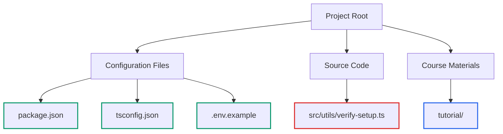
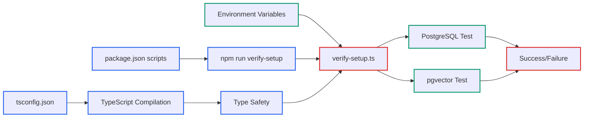

# Lecture 3: Project Structure and TypeScript Configuration Walkthrough

## Instructor Script

Welcome to our third lecture. Now that Claude Code is configured for optimal learning, let's examine the foundation that makes everything possible - our project structure and TypeScript configuration. Beyond a simple tour of files and folders, you'll understand how professional database applications are organized and configured for reliability, maintainability, and type safety.

Open your code editor and navigate to the project root directory. You'll see a clean, focused structure that demonstrates professional Node.js database application organization.

Here's what we have: the project root contains our configuration files including .env.example for environment setup, package.json for dependencies and scripts, and tsconfig.json for TypeScript compilation. Inside the src directory, we have utils containing our verify-setup.ts verification utility. The tutorial directory contains our course materials.

This structure tells a story about how database applications should be organized. Configuration files live at the root for easy access and deployment automation. Source code is organized by purpose - utilities in the utils directory. The separation between source code and tutorial materials keeps the actual implementation clean and focused.

Let's examine our TypeScript configuration by opening tsconfig.json. This file determines how TypeScript compiles our code and enforces type safety for our database operations. The configuration choices here directly impact the reliability and maintainability of our PostgreSQL integration.

Looking at the compiler options, we're targeting ES2022, which provides modern JavaScript features while maintaining compatibility with Node.js 18 and higher. This target gives us access to advanced async operations and error handling patterns essential for database work.

The module system is set to commonjs, ensuring compatibility with Node.js and the PostgreSQL libraries we use. The output directory is configured as dist, where compiled JavaScript files will be placed. The root directory is src, establishing clear separation between TypeScript source and compiled output.

Strict mode is enabled, which enforces rigorous type checking. This is crucial for database applications where type errors can lead to runtime failures, connection issues, or data corruption. When you look at our verification utility at src/utils/verify-setup.ts, notice how TypeScript prevents common mistakes like passing incorrect types to the PostgreSQL connection pool.

The configuration also enables source maps and declarations, supporting debugging and type information for any applications that might import our utilities. These settings reflect professional development practices that make code maintainable and debuggable in production environments.

Now let's examine package.json to understand our dependencies and development workflow. Open package.json and look at the scripts section. These scripts define how we build, run, and verify our application.

The verify-setup script runs our verification utility directly using ts-node. This allows us to execute TypeScript without compilation, perfect for development and verification workflows. The build script compiles TypeScript to JavaScript using the TypeScript compiler. The start script runs compiled JavaScript from the dist directory, representing production deployment patterns.

Notice the dev script references src/index.ts, which doesn't currently exist. This indicates the project is structured to support a main application file, but currently focuses on verification utilities. This is common in professional development where you build foundational tools before implementing the main application.

Let's look at the dependencies. The production dependencies include dotenv for environment variable management and pg for PostgreSQL connectivity. These are the minimal requirements for database operations. Notice how lean this dependency list is - we're not adding unnecessary complexity.

The development dependencies include TypeScript and ts-node for development workflow, plus type definitions for Node.js and PostgreSQL. Type definitions ensure TypeScript understands the APIs we're using, preventing runtime errors and enabling intelligent code completion.

Now open .env.example to see our environment configuration template. This file documents the environment variables our application requires. For PostgreSQL connectivity, we need the database host, port, database name, username, and password. These variables are validated in our verification utility at lines 24 through 37.

The environment configuration approach demonstrates security best practices for database applications. Sensitive information like passwords never appears in source code. Instead, applications read configuration from environment variables, allowing different settings for development, staging, and production environments.

Let's understand our source code organization. Currently, we have a single source file - src/utils/verify-setup.ts containing 151 lines of verification logic. This file serves multiple purposes: it validates environment setup, tests database connectivity, verifies pgvector functionality, and demonstrates proper error handling patterns.

The utils directory organization suggests this verification utility is designed to be part of a larger application. Professional applications often include utilities for health checks, environment validation, and diagnostic operations. Our verification utility provides a foundation that production applications can extend and adapt.

Let me walk you through the development workflow this structure enables. First, you copy .env.example to .env and configure your database settings. Next, you run npm run verify-setup to test connections and ensure everything works correctly. For ongoing development, you would use npm run dev, though this currently requires creating a main application file. For production deployment, you use npm run build to compile TypeScript.

There's an important workflow limitation to understand. The dev script points to src/index.ts which doesn't exist. This means the project is currently configured for verification only, not full application development. This is intentional - we're focusing on understanding database integration before building complete applications.

Here's how to use Claude Code effectively with this project structure. For project analysis, ask "Explain the purpose of each file in this Node.js TypeScript project structure." For configuration help, try "Help me understand why these TypeScript compiler options are chosen for a PostgreSQL project." For troubleshooting, use "The npm run dev script fails - analyze the package.json configuration and suggest fixes."

The key insights from this project structure are that modern TypeScript configuration is optimized for Node.js database applications with strict type checking for reliability. Environment variables drive database connectivity, as demonstrated in our verification utility. The current codebase contains verification utilities rather than a full application, focusing on foundational database operations. Package.json scripts support a verification-focused workflow that prioritizes testing database connectivity.

This structure demonstrates professional development practices that separate concerns, enforce type safety, and support reliable database operations. Every configuration choice serves the goal of building maintainable, reliable database applications.

In our next lecture, we'll set up your Node.js and TypeScript development environment, building on this foundation to create the technical infrastructure needed for PostgreSQL database applications. Take some time to examine the files we've discussed and ensure you understand how TypeScript configuration, package.json scripts, and environment variables work together to support our database verification utility.

```
nodejs-postgres-pgvector/
├── .env.example                    # Environment configuration template
├── package.json                    # Project dependencies and scripts
├── tsconfig.json                   # TypeScript compiler configuration
├── src/
│   └── utils/
│       └── verify-setup.ts         # Our core verification utility
└── tutorial/                       # Course materials (what we're building)
```



## TypeScript Configuration Deep Dive

Open `tsconfig.json` in your editor. This file configures how TypeScript compiles our code:

**Key Configuration Points:**

- **Target**: `ES2022` (tsconfig.json:3) - Modern JavaScript features for Node.js 18+
- **Module System**: `commonjs` (tsconfig.json:4) - Node.js compatibility
- **Output Directory**: `./dist` (tsconfig.json:8) - Compiled JavaScript location
- **Source Directory**: `./src` (tsconfig.json:9) - TypeScript source files
- **Strict Mode**: `true` (tsconfig.json:10) - Enhanced type checking

**Why These Settings Matter for Database Projects:**

The strict TypeScript configuration ensures type safety when working with PostgreSQL connections and vector operations. Notice how the verify-setup utility at `src/utils/verify-setup.ts:44-50` benefits from type checking on the Pool configuration object.

## Package.json Script Analysis

Open `package.json` and examine the scripts section (lines 6-11):

**Development Scripts:**

- `npm run dev`: Executes `ts-node src/index.ts` (though index.ts doesn't exist yet)
- `npm run build`: Compiles TypeScript to JavaScript using `tsc`
- `npm start`: Runs compiled JavaScript from `dist/`
- `npm run verify-setup`: Runs our verification utility directly

**Dependencies Analysis:**

**Production Dependencies:**

- `dotenv`: Environment variable loading (used in verify-setup.ts:2,5)
- `pg`: PostgreSQL client library (used in verify-setup.ts:3)

**Development Dependencies:**

- `typescript`: TypeScript compiler
- `ts-node`: Direct TypeScript execution for development
- `@types/node` & `@types/pg`: Type definitions for Node.js and PostgreSQL

## Environment Configuration Walkthrough

Open `.env.example` to see the required environment variables:

**Database Configuration Variables:**

```
POSTGRES_HOST=localhost      # Database server location
POSTGRES_PORT=5432          # Standard PostgreSQL port
POSTGRES_DB=rag_db          # Database name
POSTGRES_USER=postgres      # Database username
POSTGRES_PASSWORD=password  # Database password
```

These variables are validated in our verification utility at `src/utils/verify-setup.ts:24-37`. The code checks each required variable and reports missing ones.

## Source Code Organization

**Current Implementation:**

- **Single Source File**: `src/utils/verify-setup.ts` (151 lines)
- **No Main Application**: The `dev` script references a non-existent `src/index.ts`
- **Utility-Focused**: Code is organized around environment verification

**File Structure Rationale:**

The `src/utils/` organization suggests this is intended as a utility within a larger application. The verification script serves as both a development tool and a foundation for understanding PostgreSQL + pgvector integration.

## Development Workflow Understanding

**Typical Development Process:**

1. **Environment Setup**: Copy `.env.example` to `.env` and configure database settings
2. **Verification**: Run `npm run verify-setup` to test connections
3. **Development**: Use `npm run dev` for development (requires creating index.ts)
4. **Production Build**: Use `npm run build` to compile TypeScript

**Current Workflow Limitation:**

The `dev` script points to `src/index.ts` which doesn't exist. This means the project is currently set up for verification only, not full application development.



## Claude Code Integration Examples

Use these prompts to explore the project structure:

**Project Analysis:**
"Explain the purpose of each file in this Node.js TypeScript project structure"

**Configuration Help:**
"Help me understand why these TypeScript compiler options are chosen for a PostgreSQL project"

**Troubleshooting:**
"The npm run dev script fails - analyze the package.json configuration and suggest fixes"

## Key Takeaways

- The project uses modern TypeScript configuration optimized for Node.js database applications
- Environment variables drive database connectivity (see verify-setup.ts:24-50)
- The current codebase contains only verification utilities, not a full application
- Package.json scripts are set up for verification workflow rather than application development

## Next Steps

In the next lecture, we'll set up your Node.js and TypeScript development environment, configuring the technical foundation needed for PostgreSQL database applications.

Examine the files we've discussed and ensure you understand how the TypeScript configuration, package.json scripts, and environment variables work together to support our database verification utility.
