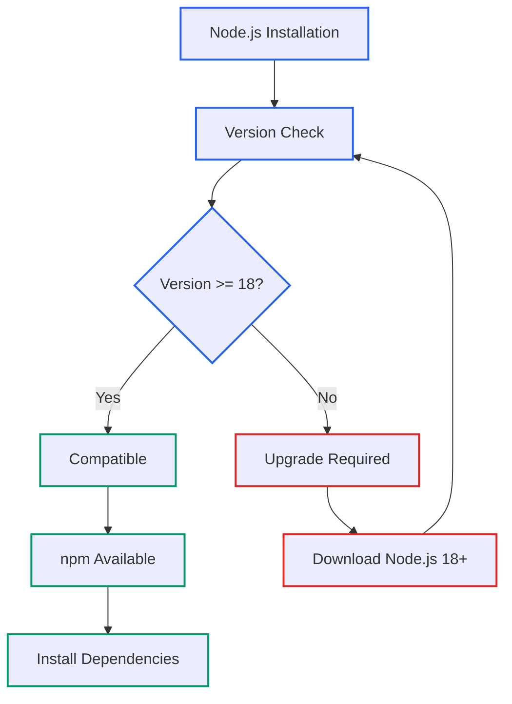
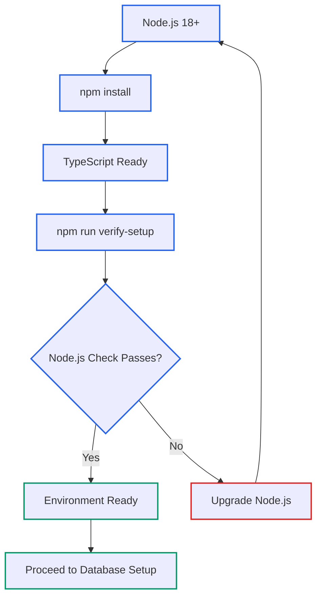

# Lecture 4: Node.js and TypeScript Development Setup

## Instructor Script

Welcome to our fourth lecture, where we transition from understanding project structure to building the technical foundation that powers our PostgreSQL vector database development. Today, we're setting up Node.js and TypeScript - not just installing software, but configuring a professional development environment that supports type-safe database operations and reliable vector computations.

Let me start with a critical point about Node.js version requirements. Our verification utility includes automatic version checking at lines 14 through 21 because Node.js compatibility directly impacts the reliability of database operations. We require Node.js 18 or higher, not just for modern JavaScript features, but because the TypeScript configuration targeting ES2022 depends on specific Node.js capabilities for optimal database connectivity and error handling.

First, let's check if you already have Node.js installed and whether it meets our requirements. Open your terminal and run node --version followed by npm --version. This tells us if Node.js is installed and whether we need to upgrade. The version check our verification utility performs automatically validates this same requirement, ensuring consistency between manual checks and automated verification.

If you need to install or upgrade Node.js, I recommend using Node Version Manager, or NVM, rather than system package managers. Here's why this matters for professional database development. NVM provides version control, allowing easy switching between Node.js versions for different projects. It's always up-to-date, installing directly from Node.js rather than distribution repositories. It avoids permission issues by installing in your home directory, and it ensures compatibility with our specific verification utility requirements.

To install NVM, run curl with the installation script, source your bash configuration, then install the latest LTS version with nvm install --lts and nvm use --lts. Verify the installation shows version 18 or higher. This LTS version provides the stability needed for production database applications while supporting all the features our TypeScript configuration requires.

Now let's understand why Node.js 18 specifically is required. Our project's TypeScript configuration targets ES2022, which you can see in tsconfig.json at line 3. This target requires Node.js 18 or higher for optimal compatibility. The verification utility validates this requirement automatically, ensuring that development and production environments use compatible Node.js versions.

Since you're building this project from scratch, let's create the complete project structure and install dependencies step by step. Start by creating the project directory with mkdir nodejs-postgres-pgvector, change into it, and initialize package.json with npm init -y. This creates the foundation for dependency management and script automation.

Next, install the production dependencies that enable PostgreSQL connectivity and environment configuration. Install pg at version 8.16.3, which is the PostgreSQL client library referenced at line 3 of our verification utility. Install dotenv at version 17.2.2 for environment variable management, used at lines 2 and 5 of our verification utility. These are the minimal dependencies needed for database operations - notice how lean this dependency list is, avoiding unnecessary complexity.

Now install the development dependencies that support TypeScript development. Install typescript at version 5.9.2 and ts-node at version 10.9.2 for compilation and runtime execution. Install the type definitions with @types/node at version 24.5.2 and @types/pg at version 8.15.5. These type definitions ensure TypeScript understands the APIs we're using, preventing runtime errors and enabling intelligent code completion.

Let me explain what each dependency accomplishes. The pg library enables database connections and query execution - this is what connects our Node.js application to PostgreSQL. Dotenv handles .env file configuration, keeping sensitive database credentials separate from source code. TypeScript provides compile-time type checking, preventing database-related errors before they reach production. ts-node enables direct TypeScript execution without compilation steps, perfect for development and verification workflows.

Create the project structure with mkdir -p src/utils to match our verification utility location. Create configuration files with touch tsconfig.json and touch .env.example. This structure follows professional Node.js project organization, separating source code, configuration, and environment settings.

Now let's create the TypeScript configuration that optimizes for database development. The configuration file sets target to ES2022 for modern JavaScript features, module to commonjs for Node.js compatibility, and enables strict type checking essential for database operations. The outDir points to dist for compiled JavaScript, while rootDir points to src for TypeScript source files.

The strict mode configuration is crucial for database applications. When enabled, TypeScript prevents common mistakes like passing incorrect types to the PostgreSQL connection pool. The esModuleInterop setting ensures compatibility with the pg library, while sourceMap enables debugging support for production troubleshooting.

Update package.json scripts to support our development workflow. Set the build script to tsc for TypeScript compilation, dev script to ts-node src/index.ts for development, start script to node dist/index.js for production, and verify-setup script to ts-node src/utils/verify-setup.ts for environment verification. These scripts define how we build, run, and verify our application throughout the development lifecycle.

Create the environment configuration file that documents required database connection parameters. Include POSTGRES_HOST for database location, POSTGRES_PORT for connection port, POSTGRES_DB for database name, POSTGRES_USER for authentication, and POSTGRES_PASSWORD for credentials. These variables are validated in our verification utility at lines 24 through 37.

Let's create an initial verification utility that tests your environment setup. This utility begins with environment variable validation and Node.js version checking, providing the foundation for the complete verification system we'll build throughout this course. The utility checks Node.js version compatibility, validates environment variable configuration, and reports readiness for PostgreSQL setup.

Now test your complete environment by running npm run verify-setup. If your environment is properly configured, you'll see verification output showing Node.js version compatibility and environment variable status. If there are issues, the utility provides specific error messages indicating what needs to be fixed.

The verification output tells you exactly what's working and what needs attention. When properly configured, you'll see Node.js version compatibility, environment variables configured, and confirmation that basic setup verification is complete. If issues exist, you'll see specific error messages for missing environment variables or version compatibility problems.

This verification confirms several critical elements: Node.js version compatibility with our database requirements, TypeScript compilation working via ts-node, environment variable configuration status, and overall readiness for database setup. These checks ensure that subsequent lectures build on a solid foundation.

Let me explain the development workflow this configuration enables. The verify-setup script uses ts-node for immediate execution without compilation, enabling rapid development and testing. The build script compiles TypeScript to JavaScript for production deployment. The start script executes compiled code in production environments. This workflow supports both development speed and production reliability.

Here are common setup issues and their solutions. If you see "Node.js 18+ required," the verification utility itself diagnoses this - upgrade Node.js using NVM. TypeScript compilation errors are caught early by the strict configuration we've implemented. Missing dependencies are resolved by running npm install to ensure all required packages are available.

Use Claude Code effectively for environment troubleshooting by asking specific questions about your setup. For Node.js issues, ask "My Node.js version check in verify-setup.ts is failing - help me diagnose the issue." For TypeScript configuration, try "Explain why this tsconfig.json configuration is optimal for a PostgreSQL Node.js project." For dependency problems, use "Help me resolve npm installation errors for this TypeScript database project."

Your setup is correct when several conditions are met: Node.js version 18 or higher is installed and verified by the utility, all packages are installed via npm install, TypeScript compilation and execution are working, and npm run verify-setup shows Node.js compatibility.

The key takeaways from this lecture are that Node.js 18 or higher is required and validated by our verification utility itself. TypeScript configuration optimizes for database development with strict type checking. Project dependencies are minimal and focused on PostgreSQL integration. ts-node enables rapid development and testing of database utilities without compilation overhead.

In our next lecture, we'll install and configure PostgreSQL with the pgvector extension, setting up the database infrastructure that our verification utility requires for testing vector operations. Ensure your Node.js and TypeScript setup is working by running the verification utility - it should pass the Node.js version check before we proceed to database configuration.

### Install NVM (Node Version Manager) - Recommended Approach

**Why NVM is better than system package managers:**

- **Version Control**: Easy switching between Node.js versions
- **Always Up-to-Date**: Direct from Node.js, not distribution repositories
- **No Permission Issues**: Installs in home directory, avoiding sudo complications
- **Easy Management**: Simple commands for version management
- **Project Compatibility**: Ensures compatibility with verification utility requirements

**NVM Installation:**

```bash
# Install NVM
curl -o- https://raw.githubusercontent.com/nvm-sh/nvm/v0.39.0/install.sh | bash
source ~/.bashrc

# Install latest LTS (Long Term Support)
nvm install --lts
nvm use --lts

# Verify installation meets our requirements
node --version  # Should show v18.x.x or higher
npm --version   # Should show compatible npm version
```

**Alternative Installation Methods:**

```bash
# Ubuntu/Debian (if you prefer package manager)
curl -fsSL https://deb.nodesource.com/setup_lts.x | sudo -E bash -
sudo apt-get install -y nodejs

# macOS with Homebrew
brew install node

# Verify installation
node --version
npm --version
```

**Why Node.js 18+ Specifically:**

The project's TypeScript configuration targets ES2022 (tsconfig.json:3), which requires Node.js 18+ for optimal compatibility. The verification utility validates this requirement automatically.



## Project Setup from Scratch

Since you're building this project from scratch, let's create the complete project structure and install dependencies step by step:

### Initialize New Node.js Project

```bash
# Create project directory
mkdir nodejs-postgres-pgvector
cd nodejs-postgres-pgvector

# Initialize package.json
npm init -y
```

### Install Production Dependencies

Install the core libraries needed for PostgreSQL and vector operations:

```bash
# PostgreSQL client library (used in verify-setup.ts:3)
npm install pg@^8.16.3

# Environment variable management (used in verify-setup.ts:2,5)
npm install dotenv@^17.2.2
```

### Install Development Dependencies

Install TypeScript and development tools:

```bash
# TypeScript compiler and runtime
npm install --save-dev typescript@^5.9.2
npm install --save-dev ts-node@^10.9.2

# Type definitions for TypeScript development
npm install --save-dev @types/node@^24.5.2
npm install --save-dev @types/pg@^8.15.5
```

### Create Project Structure

```bash
# Create source directory structure
mkdir -p src/utils

# Create configuration files (we'll populate these next)
touch tsconfig.json
touch .env.example
```

**Understanding Each Dependency:**

**Production Dependencies:**

- `pg@^8.16.3`: PostgreSQL client library - enables database connections and query execution
- `dotenv@^17.2.2`: Environment variable loader - handles .env file configuration

**Development Dependencies:**

- `typescript@^5.9.2`: TypeScript compiler - converts TypeScript to JavaScript
- `ts-node@^10.9.2`: Direct TypeScript execution - runs TypeScript without compilation step
- `@types/node@^24.5.2`: Node.js type definitions - enables TypeScript support for Node.js APIs
- `@types/pg@^8.15.5`: PostgreSQL type definitions - provides TypeScript support for pg library

## TypeScript Configuration Setup

Now create the TypeScript configuration file that optimizes for database development:

### Create tsconfig.json

```bash
# Create TypeScript configuration
cat > tsconfig.json << 'EOF'
{
    "compilerOptions": {
        "target": "ES2022",
        "module": "commonjs",
        "lib": ["ES2022"],
        "outDir": "./dist",
        "rootDir": "./src",
        "strict": true,
        "esModuleInterop": true,
        "skipLibCheck": true,
        "forceConsistentCasingInFileNames": true,
        "resolveJsonModule": true,
        "declaration": true,
        "sourceMap": true,
        "noImplicitAny": true,
        "strictNullChecks": true
    },
    "include": ["src/**/*"],
    "exclude": ["node_modules", "dist"]
}
EOF
```

### Update package.json Scripts

Add the necessary scripts for development and production:

```bash
# Update package.json scripts
npm pkg set scripts.build="tsc"
npm pkg set scripts.dev="ts-node src/index.ts"
npm pkg set scripts.start="node dist/index.js"
npm pkg set scripts.verify-setup="ts-node src/utils/verify-setup.ts"
```

### Create Environment Configuration

```bash
# Create environment variables template
cat > .env << 'EOF'
# PostgreSQL Configuration
POSTGRES_HOST=localhost
POSTGRES_PORT=5432
POSTGRES_DB=rag_db
POSTGRES_USER=postgres
POSTGRES_PASSWORD=password
EOF
```

**Understanding the TypeScript Configuration:**

**Key Settings for Database Development:**

- **ES2022 Target**: Modern JavaScript features for Node.js 18+ compatibility
- **Strict Type Checking**: `"strict": true` ensures type safety for database operations
- **ES Module Interop**: `"esModuleInterop": true` enables compatibility with pg library
- **Source Maps**: `"sourceMap": true` enables debugging support

**Development vs Production Compilation:**

- **Development**: `ts-node` executes TypeScript directly for rapid development
- **Production**: `tsc` compiles to JavaScript in `dist/` directory for deployment

### Create the Initial Verification Utility

Now create the initial verification utility that tests your environment setup:

```bash
# Create the verification utility with basic environment checks
cat > src/utils/verify-setup.ts << 'EOF'
// src/utils/verify-setup.ts
import * as dotenv from "dotenv";

dotenv.config();

async function verifySetup() {
    console.log("Verifying Development Environment Setup");
    console.log("=".repeat(50));

    // Initialize tracking variable
    let allChecksPassed = true;

    // Check Node.js version
    console.log(`Node.js version: ${process.version}`);
    if (parseInt(process.version.slice(1)) < 18) {
        console.error("Node.js 18+ required");
        allChecksPassed = false;
    } else {
        console.log("Node.js version compatible");
    }

    // Check environment variables
    const requiredEnvVars = [
        "POSTGRES_HOST",
        "POSTGRES_PORT",
        "POSTGRES_DB",
        "POSTGRES_USER",
        "POSTGRES_PASSWORD",
    ];

    for (const envVar of requiredEnvVars) {
        if (!process.env[envVar]) {
            console.error(`Missing environment variable: ${envVar}`);
            allChecksPassed = false;
        }
    }

    if (allChecksPassed) {
        console.log("Environment variables configured");
    }

    // Final status
    if (allChecksPassed) {
        console.log("\nBasic setup verification complete!");
        console.log("Ready for PostgreSQL and pgvector setup!");
    } else {
        console.log("\nSetup verification failed");
        console.log("Please fix the issues above and run again");
        process.exit(1);
    }
}

if (require.main === module) {
    verifySetup().catch(console.error);
}

export { verifySetup };
EOF
```

**Note**: This creates a functional verification utility that tests the environment setup you've just completed. In upcoming lectures, you'll extend this to include PostgreSQL connection testing and pgvector operations.

## Verifying Your Environment Setup

Test that your complete environment is properly configured:

```bash
npm run verify-setup
```

**Expected Output (if .env file is configured):**

```
Verifying Development Environment Setup
==================================================
Node.js version: v18.x.x
Node.js version compatible
Environment variables configured

Basic setup verification complete!
Ready for PostgreSQL and pgvector setup!
```

**Expected Output (if .env file is missing):**

```
Verifying Development Environment Setup
==================================================
Node.js version: v18.x.x
Node.js version compatible
Missing environment variable: POSTGRES_HOST
Missing environment variable: POSTGRES_PORT
Missing environment variable: POSTGRES_DB
Missing environment variable: POSTGRES_USER
Missing environment variable: POSTGRES_PASSWORD

Setup verification failed
Please fix the issues above and run again
```

This verification confirms:
- Node.js version compatibility
- TypeScript compilation working via ts-node
- Environment variable configuration status
- Overall readiness for database setup

## Development Workflow Integration

**TypeScript Development Commands:**

- **Direct Execution**: `npm run verify-setup` uses ts-node
- **Compilation**: `npm run build` creates JavaScript files
- **Production Run**: `npm start` executes compiled code

**Understanding ts-node Benefits:**

The verify-setup script uses ts-node for immediate execution without compilation. This enables rapid development and testing of database utilities.

## Common Setup Issues and Solutions

**Issue 1: Node.js Version Too Old**

```
Node.js 18+ required
```

**Solution**: The verification utility itself diagnoses this - upgrade Node.js

**Issue 2: TypeScript Compilation Errors**
**Solution**: The strict TypeScript configuration helps catch errors early

**Issue 3: Missing Dependencies**
**Solution**: Run `npm install` to install all required packages

## Claude Code Integration Examples

Use these prompts for Node.js and TypeScript setup help:

**Environment Troubleshooting:**
"My Node.js version check in verify-setup.ts is failing - help me diagnose the issue"

**TypeScript Configuration:**
"Explain why this tsconfig.json configuration is optimal for a PostgreSQL Node.js project"

**Dependency Issues:**
"Help me resolve npm installation errors for this TypeScript database project"

## Validating Your Environment

Your setup is correct when:

1. **Node.js Version**: 18+ installed and verified by the utility
2. **Dependencies**: All packages installed via npm install
3. **TypeScript**: Compilation and execution working
4. **Verification**: `npm run verify-setup` shows Node.js compatibility



## Key Takeaways

- Node.js 18+ is required and validated by the verification utility itself
- TypeScript configuration optimizes for database development with strict type checking
- The project dependencies are minimal and focused on PostgreSQL integration
- ts-node enables rapid development and testing of database utilities

## Next Steps

In the next lecture, we'll install and configure PostgreSQL with the pgvector extension, setting up the database infrastructure that our verification utility requires for testing vector operations.

Ensure your Node.js and TypeScript setup is working by running the verification utility - it should pass the Node.js version check before proceeding.
