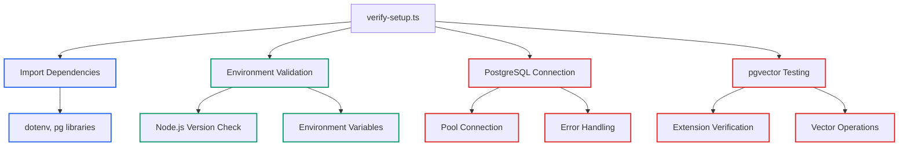

# Lecture 6: Complete verify-setup.ts Code Walkthrough

## Learning Objectives

By the end of this lecture, you will:
- Understand every line of the verification utility implementation
- Learn professional TypeScript patterns for database connections
- Analyze error handling strategies for production database code
- Identify how the verification process ensures system reliability

## Code Structure Overview

Open `src/utils/verify-setup.ts` in your editor. This 151-line file demonstrates production-quality database verification. Let's examine the complete implementation:



## Import Statements and Setup (Lines 1-6)

```typescript
// src/utils/verify-setup.ts
import * as dotenv from "dotenv";
import { Pool } from "pg";

dotenv.config();
```

**Key Implementation Details:**

- **dotenv Import** (line 2): Enables environment variable loading from .env files
- **Pool Import** (line 3): PostgreSQL connection pooling for efficient database access
- **Configuration Loading** (line 5): Automatically loads .env file when module executes

This pattern ensures environment variables are available throughout the verification process.

## Main Function Declaration and Tracking (Lines 7-12)

```typescript
async function verifySetup() {
    console.log("Verifying Development Environment Setup");
    console.log("=".repeat(50));

    // Initialize tracking variable
    let allChecksPassed = true;
```

**Professional Patterns Demonstrated:**

- **Async Function**: Enables await for database operations
- **Status Tracking**: `allChecksPassed` variable tracks overall verification state
- **User Feedback**: Clear console output provides verification progress

## Node.js Version Validation (Lines 14-21)

```typescript
// Check Node.js version
console.log(`Node.js version: ${process.version}`);
if (parseInt(process.version.slice(1)) < 18) {
    console.error("Node.js 18+ required");
    allChecksPassed = false;
} else {
    console.log("Node.js version compatible");
}
```

**Code Analysis:**

- **Version Extraction** (line 16): `process.version.slice(1)` removes 'v' prefix
- **Integer Parsing**: Converts version string to number for comparison
- **Error Handling**: Sets tracking flag and provides user feedback
- **Success Path**: Confirms compatibility when version requirements met

## Environment Variable Validation (Lines 23-41)

```typescript
// Check environment variables
const requiredEnvVars = [
    "POSTGRES_HOST",
    "POSTGRES_PORT",
    "POSTGRES_DB",
    "POSTGRES_USER",
    "POSTGRES_PASSWORD",
];

for (const envVar of requiredEnvVars) {
    if (!process.env[envVar]) {
        console.error(`Missing environment variable: ${envVar}`);
        allChecksPassed = false;
    }
}

if (allChecksPassed) {
    console.log("Environment variables configured");
}
```

**Implementation Patterns:**

- **Array-Driven Validation**: Required variables defined in array for maintainability
- **Loop-Based Checking**: Iterates through requirements systematically
- **Detailed Error Reporting**: Identifies specific missing variables
- **Conditional Success Message**: Only reports success when all variables present

## PostgreSQL Connection Setup (Lines 43-50)

```typescript
// Test PostgreSQL connection
const pool = new Pool({
    host: process.env.POSTGRES_HOST,
    port: parseInt(process.env.POSTGRES_PORT || "5432"),
    database: process.env.POSTGRES_DB,
    user: process.env.POSTGRES_USER,
    password: process.env.POSTGRES_PASSWORD,
});
```

**Database Connection Patterns:**

- **Pool Usage**: Connection pooling for production efficiency
- **Environment Integration**: Direct environment variable usage
- **Default Port**: Fallback to 5432 if POSTGRES_PORT not specified
- **Type Conversion**: `parseInt()` ensures port is numeric

## Database Connection Testing (Lines 52-55)

```typescript
try {
    const client = await pool.connect();
    console.log("PostgreSQL connection successful");
```

**Error Handling Strategy:**

- **Try-Catch Structure**: Wraps database operations for error capture
- **Client Acquisition**: Tests actual connection from pool
- **Success Confirmation**: Immediate feedback on successful connection

## PostgreSQL Version Verification (Lines 56-58)

```typescript
// Test pgvector extension
const result = await client.query("SELECT version();");
console.log(`PostgreSQL version: ${result.rows[0].version.split(" ")[1]}`);
```

**Query Implementation:**

- **Version Query**: Standard PostgreSQL version identification
- **Result Processing**: Extracts version number from result string
- **String Manipulation**: `split(" ")[1]` isolates version from full string

## pgvector Extension Testing (Lines 60-78)

```typescript
try {
    await client.query("SELECT '[1,2,3]'::vector;");
    console.log("pgvector extension working");
} catch (vectorError: any) {
    console.error("pgvector extension not found");
    console.error("   Run: CREATE EXTENSION IF NOT EXISTS vector;");
    allChecksPassed = false;

    // Skip remaining vector tests if extension not found
    client.release();
    await pool.end();

    if (!allChecksPassed) {
        console.log("\nSetup verification failed");
        console.log("Please fix the issues above and run again");
        process.exit(1);
    }
    return;
}
```

**Advanced Error Handling:**

- **Nested Try-Catch**: Specific handling for vector extension failures
- **Vector Type Test**: `'[1,2,3]'::vector` validates extension functionality
- **Early Exit Strategy**: Skips remaining tests if extension unavailable
- **Resource Cleanup**: Properly releases client and ends pool
- **Process Exit**: Terminates with error code for automation compatibility

## Vector Operations Testing (Lines 80-123)

```typescript
// Test vector operations - only run if pgvector is working
try {
    // Test vector distance calculation
    const distanceResult = await client.query(`
        SELECT '[1,2,3]'::vector <-> '[1,2,4]'::vector AS distance;
    `);
    console.log(`Vector distance calculation: ${distanceResult.rows[0].distance}`);
```

**Vector Distance Calculation:**

- **Distance Operator**: `<->` calculates Euclidean distance between vectors
- **Test Vectors**: `[1,2,3]` and `[1,2,4]` provide predictable distance result
- **Result Extraction**: Accesses distance value from query result

**Test Table Creation (Lines 89-103):**

```typescript
// Test vector operations with table
await client.query(`
    CREATE TABLE IF NOT EXISTS test_vectors (
      id SERIAL PRIMARY KEY,
      content TEXT,
      embedding VECTOR(3)
    );
`);

await client.query(`
    INSERT INTO test_vectors (content, embedding)
    VALUES
      ('First document', '[1,2,3]'),
      ('Second document', '[4,5,6]'),
      ('Third document', '[1,2,4]');
`);
```

**Table Design Patterns:**

- **Vector Column**: `VECTOR(3)` defines 3-dimensional vector storage
- **IF NOT EXISTS**: Prevents errors on repeated runs
- **Test Data**: Provides known vectors for similarity testing

**Similarity Search Testing (Lines 105-118):**

```typescript
const similarity = await client.query(`
    SELECT content, embedding <-> '[1,2,3]' AS distance
    FROM test_vectors
    ORDER BY distance
    LIMIT 3;
`);

console.log("Vector similarity search working:");
similarity.rows.forEach((row, idx) => {
    console.log(`  ${idx + 1}. "${row.content}" (distance: ${row.distance})`);
});

// Cleanup test table
await client.query("DROP TABLE test_vectors;");
```

**Similarity Search Implementation:**

- **Distance Calculation**: Compares all vectors against query vector `[1,2,3]`
- **Ordering**: `ORDER BY distance` ranks by similarity (lower = more similar)
- **Result Display**: Shows ranked results with distances
- **Cleanup**: Removes test table to maintain clean database state

## Error Handling and Cleanup (Lines 120-144)

```typescript
} catch (operationError: any) {
    console.error("Vector operations failed:", operationError.message);
    allChecksPassed = false;
}

// Release the client connection
client.release();

} catch (error: any) {
    console.error("PostgreSQL connection failed:", error.message);
    allChecksPassed = false;
} finally {
    // Always end the pool connection
    await pool.end();
}
```

**Production Error Handling:**

- **Specific Error Handling**: Different handling for vector operations vs connection
- **Resource Management**: Client release and pool termination in finally block
- **Error State Tracking**: Maintains overall verification status

## Module Export and Execution (Lines 147-151)

```typescript
if (require.main === module) {
    verifySetup().catch(console.error);
}

export { verifySetup };
```

**Module Design Patterns:**

- **Direct Execution**: Runs verification when script executed directly
- **Export Capability**: Allows import and use in other modules
- **Error Propagation**: Catches and displays any unhandled errors

## Key Takeaways

The verification utility demonstrates professional database code with:

- **Comprehensive Validation**: Environment, connection, and functionality testing
- **Robust Error Handling**: Multiple error scenarios with appropriate responses
- **Resource Management**: Proper connection pooling and cleanup
- **User Feedback**: Clear progress reporting and error messages
- **Production Patterns**: Patterns suitable for real applications

## Claude Code Integration Examples

Use these prompts to explore the verification code:

**Code Analysis:**
"Explain the error handling strategy in src/utils/verify-setup.ts lines 60-78"

**Pattern Understanding:**
"Help me understand why this code uses connection pooling instead of direct connections"

**Debugging:**
"My vector distance calculation is returning unexpected results - analyze the test in verify-setup.ts"

## Course Completion

Congratulations! You have completed the comprehensive walkthrough of PostgreSQL vector database environment setup. You now understand the complete verification utility implementation and can apply these patterns to your own database projects.

Study the complete verify-setup.ts implementation - it serves as a template for professional database verification utilities that you can adapt for your own applications.