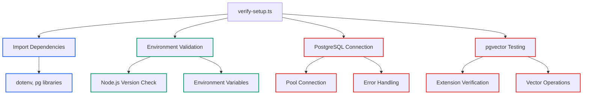

# Lecture 6: Complete verify-setup.ts Code Walkthrough

## Instructor Script

Welcome to our final lecture, where we conduct a comprehensive walkthrough of the verification utility that demonstrates every concept you need to understand for professional PostgreSQL vector database development. This isn't just a code review - we're analyzing 151 lines of production-quality TypeScript that embodies best practices for database connectivity, error handling, and vector operations.

Open src/utils/verify-setup.ts in your editor. This file represents the culmination of everything we've built together - a complete verification system that validates environment setup, tests database connectivity, verifies pgvector functionality, and demonstrates vector operations. Every line serves a purpose in creating reliable, maintainable database applications.

Let me start by explaining the overall structure of this verification utility. The file follows a logical progression from basic environment validation to complex vector operations. We begin with import statements and environment configuration, proceed through Node.js version checking and environment variable validation, establish PostgreSQL connectivity, verify pgvector extension functionality, and conclude with comprehensive vector operations testing.

This structure reflects professional development practices where simpler checks occur before more complex operations. If Node.js version requirements aren't met, there's no point testing database connectivity. If environment variables are missing, database connection attempts will fail. This fail-fast approach provides clear feedback and prevents wasted time on issues that can't succeed.

Let's examine the import statements and setup at lines 1 through 6. The dotenv import enables environment variable loading from .env files, essential for keeping sensitive database credentials separate from source code. The Pool import from the pg library provides PostgreSQL connection pooling for efficient database access. The dotenv.config() call automatically loads the .env file when the module executes, ensuring environment variables are available throughout the verification process.

This import pattern demonstrates professional Node.js development practices. Environment configuration happens at module load time, not during function execution. The Pool import specifically imports connection pooling functionality rather than the entire pg library, demonstrating efficient module usage.

The main function declaration at lines 7 through 12 establishes the verification framework. The async function declaration enables await syntax for database operations. The status tracking variable allChecksPassed maintains overall verification state throughout the process. Clear console output provides users with verification progress and feedback.

This pattern of centralized status tracking is crucial for complex verification processes. Rather than having multiple exit points throughout the code, we maintain state and provide comprehensive feedback at the end. This approach makes the verification utility more reliable and user-friendly.

Node.js version validation at lines 14 through 21 demonstrates defensive programming practices. The code extracts the version number by removing the 'v' prefix with process.version.slice(1), converts the version string to a number for comparison, and sets the tracking flag with appropriate user feedback. When version requirements are met, it confirms compatibility.

This version checking is particularly important because our TypeScript configuration targets ES2022, which requires Node.js 18 or higher. The verification utility itself validates the same requirement that our development environment depends on, ensuring consistency between manual checks and automated verification.

Environment variable validation at lines 23 through 41 shows array-driven validation patterns. Required variables are defined in an array for maintainability, allowing easy addition or removal of requirements. The loop-based checking iterates through requirements systematically, provides detailed error reporting for specific missing variables, and only reports success when all variables are present.

This validation approach reflects production database application requirements. Database applications typically require multiple environment variables for host, port, database name, credentials, and configuration options. Using an array-driven approach makes the validation code maintainable and reduces the likelihood of missing important configuration.

PostgreSQL connection setup at lines 43 through 50 demonstrates professional database connection patterns. Connection pooling provides production efficiency by reusing database connections rather than creating new ones for each operation. Environment integration uses environment variables directly for configuration. The default port fallback to 5432 handles cases where POSTGRES_PORT isn't specified. Type conversion with parseInt ensures the port value is numeric.

The Pool configuration object shows how production applications handle database connectivity. Every parameter comes from environment variables, enabling different settings for development, staging, and production environments without code changes. The connection pool manages resource usage efficiently, supporting applications that need frequent database access.

Database connection testing at lines 52 through 55 uses try-catch structure to wrap database operations for error capture. The client acquisition from the pool tests actual connectivity, not just configuration validity. Success confirmation provides immediate feedback when connection succeeds.

This connection testing pattern validates that database configuration is not only syntactically correct but also functionally working. Many database connection failures occur due to network issues, credential problems, or service availability rather than configuration syntax errors.

PostgreSQL version verification at lines 56 through 58 uses a standard PostgreSQL version identification query. The result processing extracts the version number from the result string using string manipulation to isolate the version from the full response. This information helps troubleshoot compatibility issues and confirms database functionality.

Version verification serves multiple purposes in production applications. Different PostgreSQL versions support different features, and version information helps diagnose compatibility issues. The verification utility captures this information for troubleshooting and documentation purposes.

pgvector extension testing at lines 60 through 78 demonstrates advanced error handling with nested try-catch structure. The vector type test '[1,2,3]'::vector validates extension functionality with a simple operation. Early exit strategy skips remaining tests if the extension is unavailable. Resource cleanup properly releases the client and ends the pool connection. Process exit terminates with an error code for automation compatibility.

This extension testing illustrates the complexity of working with PostgreSQL extensions. Extensions must be installed system-wide and enabled per database. The verification utility tests both installation and database-specific enablement, providing specific guidance when issues are detected.

Vector operations testing at lines 80 through 123 demonstrates comprehensive vector database functionality. The distance operator <-> calculates Euclidean distance between vectors. Test vectors [1,2,3] and [1,2,4] provide predictable results for validation. Result extraction accesses the distance value from query results.

The test table creation shows production table design patterns. The VECTOR(3) column defines 3-dimensional vector storage appropriate for our test data. IF NOT EXISTS prevents errors on repeated runs, important for utility scripts that might run multiple times. Test data provides known vectors for similarity testing with predictable results.

Similarity search testing demonstrates real-world vector database operations. Distance calculation compares all vectors against a query vector. Ordering by distance ranks results by similarity, with lower values indicating greater similarity. Result display shows ranked results with distances for verification. Cleanup removes the test table to maintain clean database state.

This similarity search implementation shows the core functionality that makes vector databases valuable for AI applications. The ability to find similar vectors based on mathematical distance calculations enables semantic search, recommendation systems, and content matching.

Error handling and cleanup at lines 120 through 144 demonstrates production error handling patterns. Specific error handling provides different responses for vector operations versus connection issues. Resource management ensures client release and pool termination occur regardless of success or failure. Error state tracking maintains overall verification status throughout the process.

The finally block ensures resource cleanup happens regardless of how the function exits. This pattern prevents connection leaks and resource exhaustion in production applications. Proper resource management is crucial for applications that run continuously or handle many concurrent requests.

Module export and execution at lines 147 through 151 shows professional module design patterns. Direct execution runs verification when the script is executed directly from the command line. Export capability allows import and use in other modules or applications. Error propagation catches and displays any unhandled errors that might occur during execution.

This dual-purpose design makes the verification utility useful both as a standalone tool and as a module that can be integrated into larger applications. Production applications often include health check utilities that can be run independently or integrated into monitoring systems.

The key takeaways from this code walkthrough demonstrate that professional database code requires comprehensive validation of environment, connection, and functionality. Robust error handling addresses multiple error scenarios with appropriate responses. Resource management includes proper connection pooling and cleanup procedures. User feedback provides clear progress reporting and error messages. Production patterns shown here are suitable for real applications.

Throughout our course, we've built understanding from foundational concepts through practical implementation. You now have the knowledge to build reliable PostgreSQL vector database applications, understand the integration points that matter for production systems, troubleshoot common issues that arise in development and deployment, and extend these patterns for your specific use cases.

The verification utility serves as a template for professional database verification utilities that you can adapt for your own applications. Study the complete implementation, understand the error handling patterns, and apply these concepts to build robust vector database applications.

Use Claude Code to explore specific aspects of the verification utility. Ask questions about error handling strategies, connection pooling benefits, vector operation implementations, and production deployment considerations. The combination of this working code and AI assistance provides you with resources to continue learning and building advanced database applications.

Congratulations on completing this comprehensive course on PostgreSQL vector database development. You now have the foundation to build modern AI-powered applications with confidence and professional-quality code.



## Import Statements and Setup (Lines 1-6)

```typescript
// src/utils/verify-setup.ts
import * as dotenv from "dotenv";
import { Pool } from "pg";

dotenv.config();
```

**Key Implementation Details:**

- **dotenv Import** (line 2): Enables environment variable loading from .env files
- **Pool Import** (line 3): PostgreSQL connection pooling for efficient database access
- **Configuration Loading** (line 5): Automatically loads .env file when module executes

This pattern ensures environment variables are available throughout the verification process.

## Main Function Declaration and Tracking (Lines 7-12)

```typescript
async function verifySetup() {
    console.log("Verifying Development Environment Setup");
    console.log("=".repeat(50));

    // Initialize tracking variable
    let allChecksPassed = true;
```

**Professional Patterns Demonstrated:**

- **Async Function**: Enables await for database operations
- **Status Tracking**: `allChecksPassed` variable tracks overall verification state
- **User Feedback**: Clear console output provides verification progress

## Node.js Version Validation (Lines 14-21)

```typescript
// Check Node.js version
console.log(`Node.js version: ${process.version}`);
if (parseInt(process.version.slice(1)) < 18) {
    console.error("Node.js 18+ required");
    allChecksPassed = false;
} else {
    console.log("Node.js version compatible");
}
```

**Code Analysis:**

- **Version Extraction** (line 16): `process.version.slice(1)` removes 'v' prefix
- **Integer Parsing**: Converts version string to number for comparison
- **Error Handling**: Sets tracking flag and provides user feedback
- **Success Path**: Confirms compatibility when version requirements met

## Environment Variable Validation (Lines 23-41)

```typescript
// Check environment variables
const requiredEnvVars = [
    "POSTGRES_HOST",
    "POSTGRES_PORT",
    "POSTGRES_DB",
    "POSTGRES_USER",
    "POSTGRES_PASSWORD",
];

for (const envVar of requiredEnvVars) {
    if (!process.env[envVar]) {
        console.error(`Missing environment variable: ${envVar}`);
        allChecksPassed = false;
    }
}

if (allChecksPassed) {
    console.log("Environment variables configured");
}
```

**Implementation Patterns:**

- **Array-Driven Validation**: Required variables defined in array for maintainability
- **Loop-Based Checking**: Iterates through requirements systematically
- **Detailed Error Reporting**: Identifies specific missing variables
- **Conditional Success Message**: Only reports success when all variables present

## PostgreSQL Connection Setup (Lines 43-50)

```typescript
// Test PostgreSQL connection
const pool = new Pool({
    host: process.env.POSTGRES_HOST,
    port: parseInt(process.env.POSTGRES_PORT || "5432"),
    database: process.env.POSTGRES_DB,
    user: process.env.POSTGRES_USER,
    password: process.env.POSTGRES_PASSWORD,
});
```

**Database Connection Patterns:**

- **Pool Usage**: Connection pooling for production efficiency
- **Environment Integration**: Direct environment variable usage
- **Default Port**: Fallback to 5432 if POSTGRES_PORT not specified
- **Type Conversion**: `parseInt()` ensures port is numeric

## Database Connection Testing (Lines 52-55)

```typescript
try {
    const client = await pool.connect();
    console.log("PostgreSQL connection successful");
```

**Error Handling Strategy:**

- **Try-Catch Structure**: Wraps database operations for error capture
- **Client Acquisition**: Tests actual connection from pool
- **Success Confirmation**: Immediate feedback on successful connection

## PostgreSQL Version Verification (Lines 56-58)

```typescript
// Test pgvector extension
const result = await client.query("SELECT version();");
console.log(`PostgreSQL version: ${result.rows[0].version.split(" ")[1]}`);
```

**Query Implementation:**

- **Version Query**: Standard PostgreSQL version identification
- **Result Processing**: Extracts version number from result string
- **String Manipulation**: `split(" ")[1]` isolates version from full string

## pgvector Extension Testing (Lines 60-78)

```typescript
try {
    await client.query("SELECT '[1,2,3]'::vector;");
    console.log("pgvector extension working");
} catch (vectorError: any) {
    console.error("pgvector extension not found");
    console.error("   Run: CREATE EXTENSION IF NOT EXISTS vector;");
    allChecksPassed = false;

    // Skip remaining vector tests if extension not found
    client.release();
    await pool.end();

    if (!allChecksPassed) {
        console.log("\nSetup verification failed");
        console.log("Please fix the issues above and run again");
        process.exit(1);
    }
    return;
}
```

**Advanced Error Handling:**

- **Nested Try-Catch**: Specific handling for vector extension failures
- **Vector Type Test**: `'[1,2,3]'::vector` validates extension functionality
- **Early Exit Strategy**: Skips remaining tests if extension unavailable
- **Resource Cleanup**: Properly releases client and ends pool
- **Process Exit**: Terminates with error code for automation compatibility

## Vector Operations Testing (Lines 80-123)

```typescript
// Test vector operations - only run if pgvector is working
try {
    // Test vector distance calculation
    const distanceResult = await client.query(`
        SELECT '[1,2,3]'::vector <-> '[1,2,4]'::vector AS distance;
    `);
    console.log(`Vector distance calculation: ${distanceResult.rows[0].distance}`);
```

**Vector Distance Calculation:**

- **Distance Operator**: `<->` calculates Euclidean distance between vectors
- **Test Vectors**: `[1,2,3]` and `[1,2,4]` provide predictable distance result
- **Result Extraction**: Accesses distance value from query result

**Test Table Creation (Lines 89-103):**

```typescript
// Test vector operations with table
await client.query(`
    CREATE TABLE IF NOT EXISTS test_vectors (
      id SERIAL PRIMARY KEY,
      content TEXT,
      embedding VECTOR(3)
    );
`);

await client.query(`
    INSERT INTO test_vectors (content, embedding)
    VALUES
      ('First document', '[1,2,3]'),
      ('Second document', '[4,5,6]'),
      ('Third document', '[1,2,4]');
`);
```

**Table Design Patterns:**

- **Vector Column**: `VECTOR(3)` defines 3-dimensional vector storage
- **IF NOT EXISTS**: Prevents errors on repeated runs
- **Test Data**: Provides known vectors for similarity testing

**Similarity Search Testing (Lines 105-118):**

```typescript
const similarity = await client.query(`
    SELECT content, embedding <-> '[1,2,3]' AS distance
    FROM test_vectors
    ORDER BY distance
    LIMIT 3;
`);

console.log("Vector similarity search working:");
similarity.rows.forEach((row, idx) => {
    console.log(`  ${idx + 1}. "${row.content}" (distance: ${row.distance})`);
});

// Cleanup test table
await client.query("DROP TABLE test_vectors;");
```

**Similarity Search Implementation:**

- **Distance Calculation**: Compares all vectors against query vector `[1,2,3]`
- **Ordering**: `ORDER BY distance` ranks by similarity (lower = more similar)
- **Result Display**: Shows ranked results with distances
- **Cleanup**: Removes test table to maintain clean database state

## Error Handling and Cleanup (Lines 120-144)

```typescript
} catch (operationError: any) {
    console.error("Vector operations failed:", operationError.message);
    allChecksPassed = false;
}

// Release the client connection
client.release();

} catch (error: any) {
    console.error("PostgreSQL connection failed:", error.message);
    allChecksPassed = false;
} finally {
    // Always end the pool connection
    await pool.end();
}
```

**Production Error Handling:**

- **Specific Error Handling**: Different handling for vector operations vs connection
- **Resource Management**: Client release and pool termination in finally block
- **Error State Tracking**: Maintains overall verification status

## Module Export and Execution (Lines 147-151)

```typescript
if (require.main === module) {
    verifySetup().catch(console.error);
}

export { verifySetup };
```

**Module Design Patterns:**

- **Direct Execution**: Runs verification when script executed directly
- **Export Capability**: Allows import and use in other modules
- **Error Propagation**: Catches and displays any unhandled errors

## Key Takeaways

The verification utility demonstrates professional database code with:

- **Comprehensive Validation**: Environment, connection, and functionality testing
- **Robust Error Handling**: Multiple error scenarios with appropriate responses
- **Resource Management**: Proper connection pooling and cleanup
- **User Feedback**: Clear progress reporting and error messages
- **Production Patterns**: Patterns suitable for real applications

## Claude Code Integration Examples

Use these prompts to explore the verification code:

**Code Analysis:**
"Explain the error handling strategy in src/utils/verify-setup.ts lines 60-78"

**Pattern Understanding:**
"Help me understand why this code uses connection pooling instead of direct connections"

**Debugging:**
"My vector distance calculation is returning unexpected results - analyze the test in verify-setup.ts"

## Course Completion

Congratulations! You have completed the comprehensive walkthrough of PostgreSQL vector database environment setup. You now understand the complete verification utility implementation and can apply these patterns to your own database projects.

Study the complete verify-setup.ts implementation - it serves as a template for professional database verification utilities that you can adapt for your own applications.